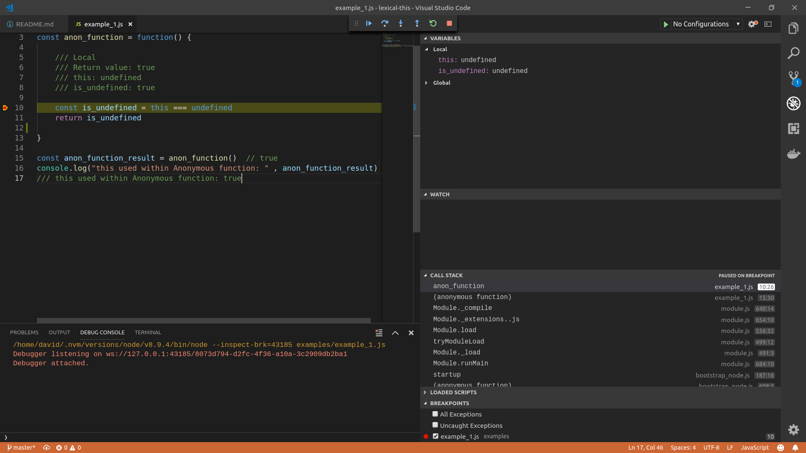
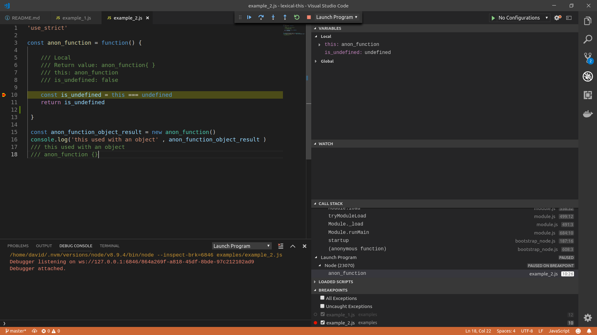
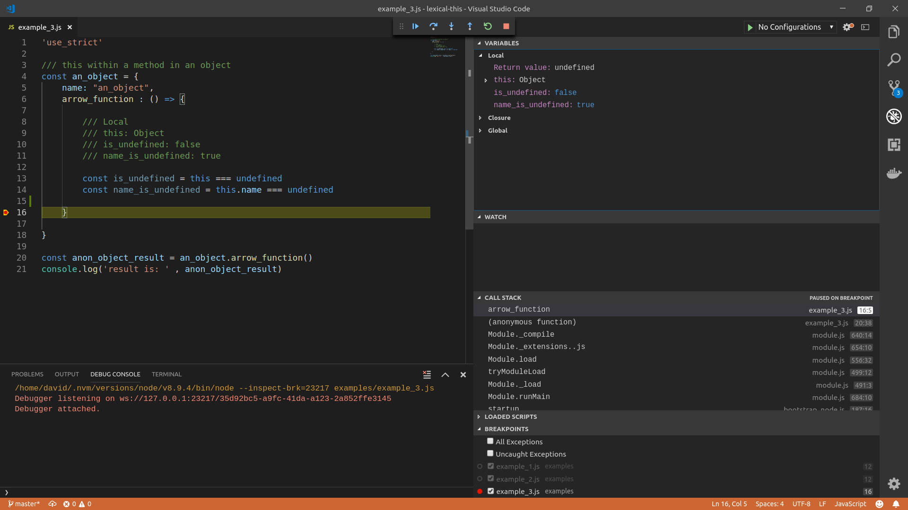
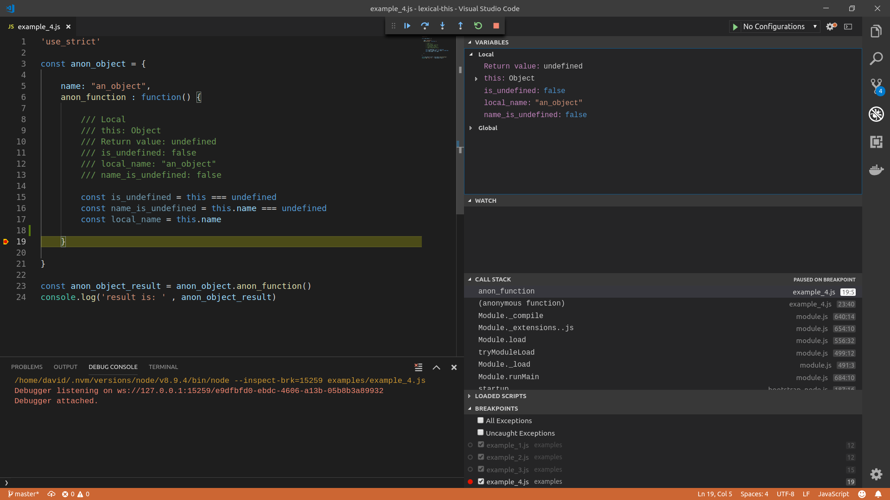
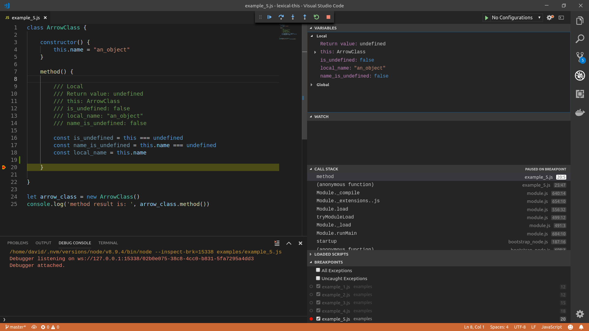
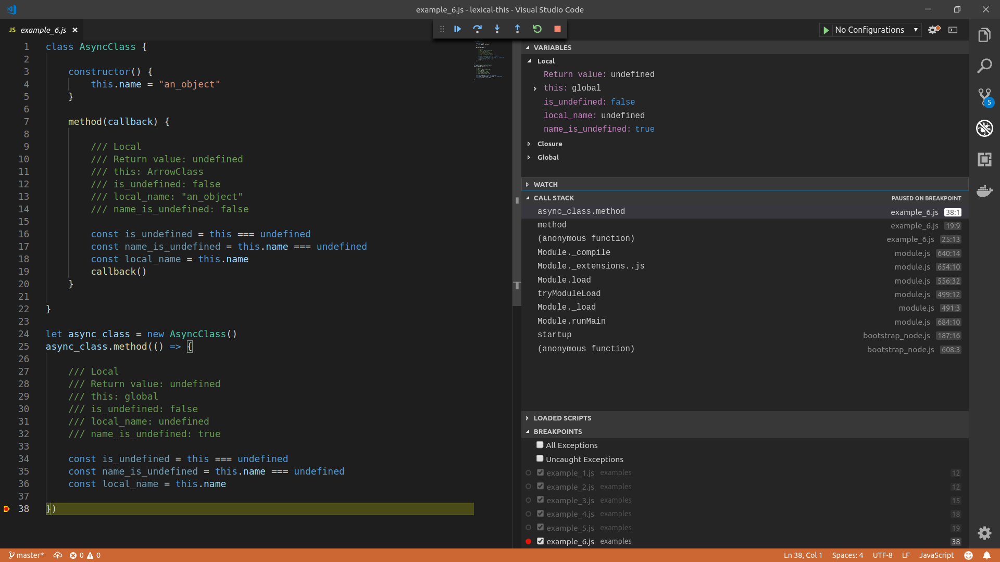
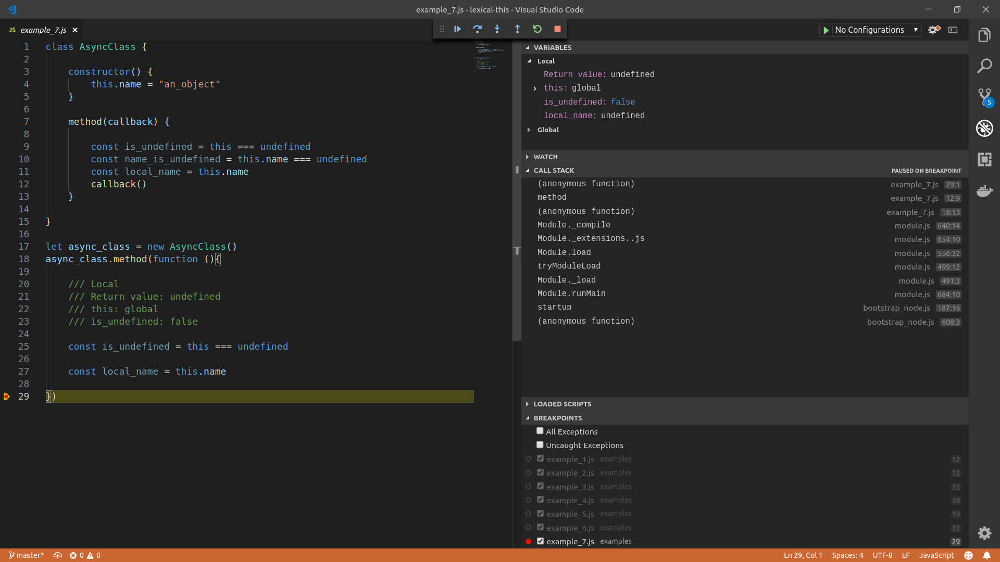
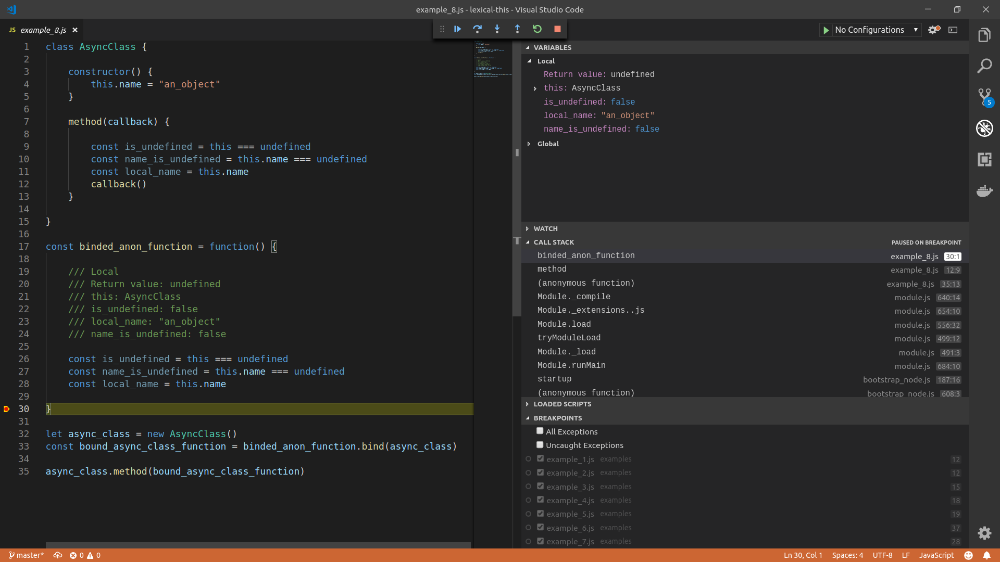
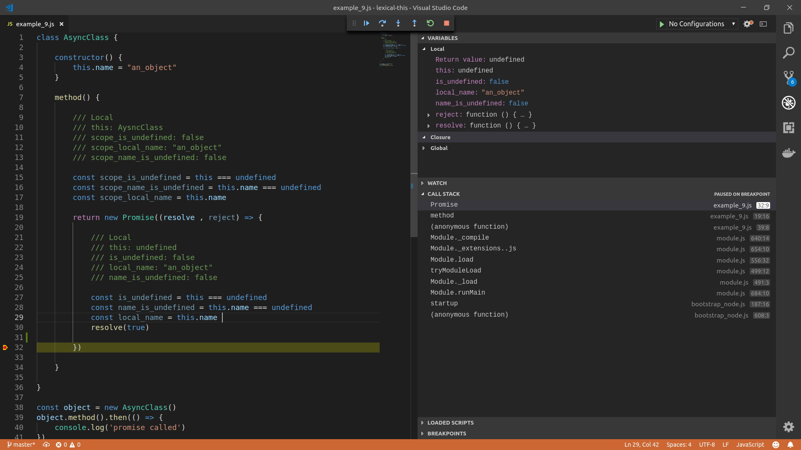
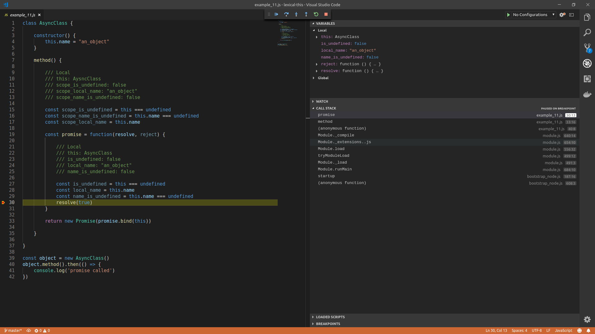

# Lexical this in Javascript

So without getting technical at all, I am going to try and demonstrate what lexical this is using javascript.

Basically to show you when `this`is defined and when it is `undefined` and also to what it is defined to.

So lets start:

## Example 1

### Anonymous function

If we define an Anonymous function and then call it normally without using the `new` so as to create an object you will be provided with the following results.

```javascript
const anon_function = function() {

    /// Local
    /// Return value: true
    /// this: undefined
    /// is_undefined: true

    const is_undefined = this === undefined
    return is_undefined
}

const anon_function_result = anon_function()  // true
console.log("this used within Anonymous function: " , anon_function_result)
/// this used within Anonymous function: true
```


## Example 2

### Anonymous function called with `new` keyword
 ```javascript
const anon_function = function() {

    /// Local
    /// Return value: anon_function{ }
    /// this: anon_function
    /// is_undefined: false

    const is_undefined = this === undefined
    return is_undefined
}

const anon_function_object_result = new anon_function()
console.log('this used with an object' , anon_function_object_result )
/// this used with an object
/// anon_function {}
```



## Example 3

### This in an arrow function within an Object

```javascript
const an_object = {
    name: "an_object",
    arrow_function : () => {

        /// Local
        /// this: Object
        /// is_undefined: false
        /// name_is_undefined: true

        const is_undefined = this === undefined
        const name_is_undefined = this.name === undefined
    }

}

const anon_object_result = an_object.arrow_function()
console.log('result is: ' , anon_object_result)
```


## Example 4

### This in an anonymous function within an object

```javascript
const anon_object = {
    
    name: "an_object",
    anon_function : function() {

        /// Local
        /// this: Object
        /// Return value: undefined
        /// is_undefined: false
        /// local_name: "an_object"
        /// name_is_undefined: false

        const is_undefined = this === undefined
        const name_is_undefined = this.name === undefined
        const local_name = this.name
    }

}

const anon_object_result = anon_object.anon_function()
console.log('result is: ' , anon_object_result)
```


## Example 5

### This used within a class method

```javascript
class ArrowClass {

    constructor() {
        this.name = "an_object"
    }

    method() {

        /// Local
        /// Return value: undefined
        /// this: ArrowClass
        /// is_undefined: false
        /// local_name: "an_object"
        /// name_is_undefined: false

        const is_undefined = this === undefined
        const name_is_undefined = this.name === undefined
        const local_name = this.name 
    }

}

let arrow_class = new ArrowClass()
console.log('method result is: ', arrow_class.method())
```



## Example 6

### This used within an arrow function passed to a high order method of a class

```javascript
class AsyncClass {

    constructor() {
        this.name = "an_object"
    }

    method(callback) {
        
        /// Local
        /// Return value: undefined
        /// this: ArrowClass
        /// is_undefined: false
        /// local_name: "an_object"
        /// name_is_undefined: false

        const is_undefined = this === undefined
        const name_is_undefined = this.name === undefined
        const local_name = this.name 
        callback()
    }

}

let async_class = new AsyncClass()
async_class.method(() => {

    /// Local
    /// Return value: undefined
    /// this: global
    /// is_undefined: false
    /// local_name: undefined
    /// name_is_undefined: true

    const is_undefined = this === undefined
    const name_is_undefined = this.name === undefined
    const local_name = this.name 

})
```




## Example 7

### This used within an anonymous function passed to a high order function of a class method

```javascript
class AsyncClass {

    constructor() {
        this.name = "an_object"
    }

    method(callback) {

        const is_undefined = this === undefined
        const name_is_undefined = this.name === undefined
        const local_name = this.name 
        callback()
    }

}

let async_class = new AsyncClass()
async_class.method(function (){

    /// Local
    /// Return value: undefined
    /// this: global
    /// is_undefined: true
    /// local_name: undefined

    const is_undefined = this === undefined

    const local_name = this.name

})
```



## Example 8

### Binding this to a function using bind

```javascript
class AsyncClass {

    constructor() {
        this.name = "an_object"
    }

    method(callback) {

        const is_undefined = this === undefined
        const name_is_undefined = this.name === undefined
        const local_name = this.name 
        callback()
    }

}

const binded_anon_function = function() {
    
    /// Local
    /// Return value: undefined
    /// this: AsyncClass
    /// is_undefined: false
    /// local_name: "an_object"
    /// name_is_undefined: false

    const is_undefined = this === undefined
    const name_is_undefined = this.name === undefined
    const local_name = this.name 

}

let async_class = new AsyncClass()
const bound_async_class_function = binded_anon_function.bind(async_class)

async_class.method(bound_async_class_function)
``` 



## Example 9

### Using this within an arrow function within a class method

``` javascript
class AsyncClass {

    constructor() {
        this.name = "an_object"
    }

    method() {
       
        /// Local
        /// this: AysncClass
        /// scope_is_undefined: false
        /// scope_local_name: "an_object"
        /// scope_name_is_undefined: false

        const scope_is_undefined = this === undefined
        const scope_name_is_undefined = this.name === undefined
        const scope_local_name = this.name 

        return new Promise((resolve , reject) => {
            
            /// Local 
            /// this: undefined
            /// is_undefined: false
            /// local_name: "an_object"
            /// name_is_undefined: false

            const is_undefined = this === undefined
            const name_is_undefined = this.name === undefined
            const local_name = this.name 
            resolve(true)
        })

    }

}

const object = new AsyncClass()
object.method().then(() => {
    console.log('promise called')
})
```




## Example 10

### Using this within an anonymous function within a class method

```javascript
class AsyncClass {

    constructor() {
        this.name = "an_object"
    }

    method() {
       
        /// Local
        /// this: AysncClass
        /// scope_is_undefined: false
        /// scope_local_name: "an_object"
        /// scope_name_is_undefined: false

        const scope_is_undefined = this === undefined
        const scope_name_is_undefined = this.name === undefined
        const scope_local_name = this.name 

        return new Promise(function(resolve, reject){
            
            /// Local 
            /// this: undefined
            /// is_undefined: false
            
            const is_undefined = this === undefined

            /// Cannot read property of 'name' of undefined
            //const name_is_undefined = this.name === undefined
            resolve(true)
        })

    }

}

const object = new AsyncClass()
object.method().then(() => {
    console.log('promise called')
})
```



## Example 11

### Using this within a binded anonymous function within a class method

```javascript
class AsyncClass {

    constructor() {
        this.name = "an_object"
    }

    method() {
       
        /// Local
        /// this: AysncClass
        /// scope_is_undefined: false
        /// scope_local_name: "an_object"
        /// scope_name_is_undefined: false

        const scope_is_undefined = this === undefined
        const scope_name_is_undefined = this.name === undefined
        const scope_local_name = this.name 

        const promise = function(resolve, reject) {
            
            /// Local
            /// this: AsyncClass
            /// is_undefined: false
            /// local_name: "an_object"
            /// name_is_undefined: false
            
            const is_undefined = this === undefined
            const local_name = this.name
            const name_is_undefined = this.name === undefined
            resolve(true)
        }

        return new Promise(promise.bind(this))

    }

}

const object = new AsyncClass()
object.method().then(() => {
    console.log('promise called')
})

```


